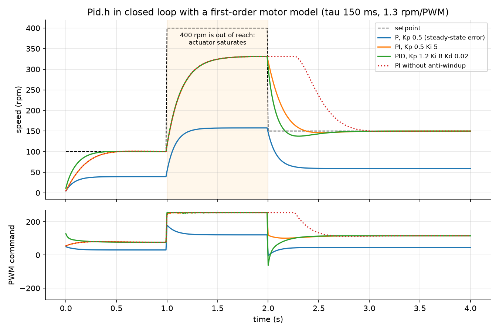

# DC Motor Speed Control with PID


Closed-loop speed regulation of a geared DC motor on an Arduino Uno. A quadrature encoder measures shaft speed, a PID controller running at a fixed 100 Hz computes the PWM command, and an H-bridge drives the motor in both directions. Gains and setpoint are tuned live over the serial port while the Arduino Serial Plotter shows the response.

The PID is a hardware-independent library with host-side unit tests that close the loop on a simulated motor, so controller behaviour is verified before it ever touches hardware.

## Controller features

| Feature | Why it matters |
| --- | --- |
| Fixed-rate loop (100 Hz, `micros()` scheduling) | Discrete gains are only meaningful with a constant sample period |
| Derivative on measurement | A setpoint step does not produce a derivative "kick" |
| Low-pass filter on the derivative | Encoder quantisation noise is not amplified into PWM jitter |
| Output clamping with conditional-integration anti-windup | After saturation the integral does not overshoot the next setpoint |
| Bumpless reset | Re-enabling the loop starts from the current speed |

## Simulated response



*`lib/Pid/Pid.h` compiled natively and run in closed loop with the first-order motor model of the unit tests. The P controller keeps a steady-state error; the integral term removes it. Between 1 s and 2 s the setpoint is out of reach and the PWM saturates: with anti-windup the controller recovers as soon as the setpoint returns to 150 rpm, without it the integral keeps the motor at full power for about 300 ms longer. Regenerate with `python docs/make_figures.py` (needs g++).*

## Hardware

| Component | Arduino pin |
| --- | --- |
| Encoder channel A | D2 (interrupt) |
| Encoder channel B | D4 |
| H-bridge enable (PWM) | D5 |
| H-bridge IN1 / IN2 | D7 / D8 |

Reference configuration: JGA25-370 style gear motor (11 PPR encoder, 30:1 gearbox, about 330 rpm at 12 V) with an L298N or TB6612FNG driver. Adjust `COUNTS_PER_REV` and `MAX_RPM` in `src/main.cpp` for other motors.

```
 12 V ──> H-bridge ──> Motor
             ^  ^         │
   D5 PWM ───┘  └── D7, D8│ direction
                          │
            Encoder A ──> D2 (rising-edge interrupt)
            Encoder B ──> D4 (direction)
```

## Getting started

```bash
git clone https://github.com/GUELORD-MWENDERWA/dc-motor-pid-controller.git
cd dc-motor-pid-controller
pio test -e native        # run the controller unit tests on your computer
pio run -e uno -t upload  # flash the Arduino
pio device monitor        # or open the Arduino Serial Plotter at 115200 baud
```

### Prebuilt firmware

Each [release](https://github.com/GUELORD-MWENDERWA/dc-motor-pid-controller/releases/latest) contains `dc-motor-pid-controller-uno.hex` for the Arduino Uno (ATmega328P). Flash it without installing PlatformIO:

```bash
avrdude -p m328p -c arduino -P /dev/ttyUSB0 -b 115200 -U flash:w:dc-motor-pid-controller-uno.hex:i
```

On Windows the port is `COM3` or similar; `avrdude` ships with the Arduino IDE.

## Serial commands

| Command | Effect |
| --- | --- |
| `s120` | Setpoint to 120 rpm (negative values reverse) |
| `p0.6`, `i4`, `d0.005` | Set Kp, Ki, Kd |
| `f0.3` | Derivative filter coefficient (1 = no filtering) |
| `x` / `g` | Stop the motor / resume control |
| `t` | Toggle telemetry |
| `?` | Print state |

Telemetry is printed at 20 Hz as `setpoint:120,rpm:118.4,pwm:143.2`, which the Serial Plotter draws as three traces.

## Tuning procedure

1. Set `i0` and `d0`. Increase Kp until the speed follows steps quickly with a small steady-state error and no sustained oscillation.
2. Increase Ki until the steady-state error disappears within about half a second. Too much Ki causes overshoot.
3. Add a small Kd only if overshoot remains, and filter it (`f0.2` to `f0.5`).
4. Test a large step (0 to 300 rpm and back): with anti-windup, the return to a lower setpoint should not overshoot.

## Unit tests

`test/test_pid` closes the loop around a first-order motor model (time constant 150 ms, 1.3 rpm per PWM unit) and verifies:

- a P-only controller settles at the predicted steady-state error `K Kp / (1 + K Kp)`
- integral action removes the steady-state error
- the output is clamped to the PWM range
- anti-windup: after 3 s of saturation the loop settles 4.8 times faster than without it (35 versus 168 control periods)
- no derivative kick on a setpoint step
- the derivative filter reduces noise amplification by more than 5 times
- reset clears the controller state

## Project layout

```
lib/Pid/Pid.h            PID controller (header-only, no Arduino dependency)
src/main.cpp             Encoder ISR, control loop, H-bridge driver, serial console
test/test_pid/           Host-side Unity tests with a motor model
platformio.ini           uno (firmware) and native (tests) environments
```

## Limitations

- x1 encoder decoding (one interrupt per pulse on channel A) gives 330 counts per revolution; at low speed the 10 ms speed estimate is coarse. x4 decoding or period measurement would improve it.
- The motor model in the tests is linear; real motors add dead zone and friction.

## Status

The firmware compiles for the Arduino Uno and the controller passes its unit tests on the host. It has not yet been validated on a physical motor.

## License

MIT. See [LICENSE](LICENSE).
